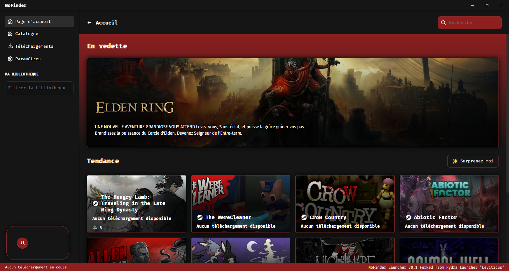

<br>

<div align="center">

[](https://hydralauncher.site)

  <h1 align="center">NoFinder Autocrack</h1>
  
  <p align="center">
    <strong>Le NoFinder Autocrack est un version personalisée du HydraLauncher (fork), nous avons seulement modifié l'interface pour correspondre au pseudo Autocrack annoncé par cFinder </strong>
  </p>



</div>

## Table des Matières

- [À propos](#à-propos)
- [Fonctionnalités](#fonctionnalités)
- [Installation](#installation)
- [Contribuer](#contribuer)
  - [Rejoindre notre Discord](#rejoindre-notre-telegram)
- [Compiler depuis les sources](#compiler-depuis-les-sources)
  - [Installer Node.js](#installer-nodejs)
  - [Installer Yarn](#installer-yarn)
  - [Installer les dépendances Node](#installer-les-dépendances-node)
  - [Installer Python 3.9](#installer-python-39)
  - [Installer les dépendances Python](#installer-les-dépendances-python)
- [Variables d'environnement](#variables-denvironnement)
- [Lancement](#lancement)
- [Compilation](#compilation)
  - [Compiler le client bittorrent](#compiler-le-client-bittorrent)
  - [Compiler l'application Electron](#compiler-lapplication-electron)
- [Contributeurs](#contributeurs)

## À propos

**Hydra** est un **lanceur de jeux** avec son propre **client BitTorrent** intégré et un **scraper de repack auto-géré**.
<br>
Le lanceur est écrit en TypeScript (Electron) et Python, qui gère le système de torrent en utilisant libtorrent.

## Fonctionnalités

- Scraper de repack auto-géré parmi tous les sites les plus fiables sur le [Megathread]("https://www.reddit.com/r/Piracy/wiki/megathread/")
- Client bittorrent intégré
- Intégration How Long To Beat (HLTB) sur la page du jeu
- Personnalisation des chemins de téléchargement
- Notifications de mise à jour de la liste de repack
- Support pour Windows et Linux
- Constamment mis à jour
- Et plus encore ...

## Installation

Suivez les étapes ci-dessous pour installer :

1. Téléchargez la dernière version de Hydra depuis la page [Releases](https://github.com/hydralauncher/hydra/releases/latest).
   - Téléchargez uniquement le .exe si vous voulez installer Hydra sur Windows.
   - Téléchargez .deb ou .rpm ou .zip si vous voulez installer Hydra sur Linux (cela dépend de votre distribution Linux).
2. Exécutez le fichier téléchargé.
3. Profitez de Hydra !

## Contribuer

### Rejoindre notre Discord

Nous concentrons nos discussions sur notre [Discord](https://discord.gg/ZjknNUTefE)

## Compiler depuis les sources

### Installer Node.js

Assurez-vous que Node.js est installé sur votre machine. Sinon, téléchargez et installez-le depuis [nodejs.org](https://nodejs.org/).

### Installer Yarn

Yarn est un gestionnaire de paquets pour Node.js. Si vous n'avez pas encore installé Yarn, vous pouvez le faire en suivant les instructions sur [yarnpkg.com](https://classic.yarnpkg.com/lang/en/docs/install/).

### Installer les dépendances Node

Naviguez vers le répertoire du projet et installez les dépendances Node en utilisant Yarn :

```bash
cd hydra
yarn
```

### Installer Python 3.9

Assurez-vous que Python 3.9 est installé sur votre machine. Vous pouvez le télécharger et l'installer depuis [python.org](https://www.python.org/downloads/release/python-3913/).

### Installer les dépendances Python

Installez les dépendances Python requises en utilisant pip :

```bash
pip install -r requirements.txt
```

## Variables d'environnement

Vous aurez besoin d'une clé API SteamGridDB pour récupérer les icônes de jeux lors de l'installation.
Si vous voulez avoir onlinefix comme repacker, vous devrez ajouter vos identifiants au fichier .env.

Une fois que vous l'avez, vous pouvez copier ou renommer le fichier `.env.example` en `.env` et y mettre `STEAMGRIDDB_API_KEY`, `ONLINEFIX_USERNAME`, `ONLINEFIX_PASSWORD`.

## Lancement

Une fois que vous avez tout configuré, vous pouvez exécuter la commande suivante pour démarrer à la fois le processus Electron et le client bittorrent :

```bash
yarn dev
```

## Compilation

### Compiler le client bittorrent

Compilez le client bittorrent en utilisant cette commande :

```bash
python torrent-client/setup.py build
```

### Compiler l'application Electron

Compilez l'application Electron en utilisant cette commande :

Sur Windows :

```bash
yarn build:win
```

Sur Linux :

```bash
yarn build:linux
```

## Contributeurs

Tout le mérite revient a la team HydraLauncher et a tous leurs contributeurs, les modifcations mineures ont été faites par moi (AnzioFckr)


